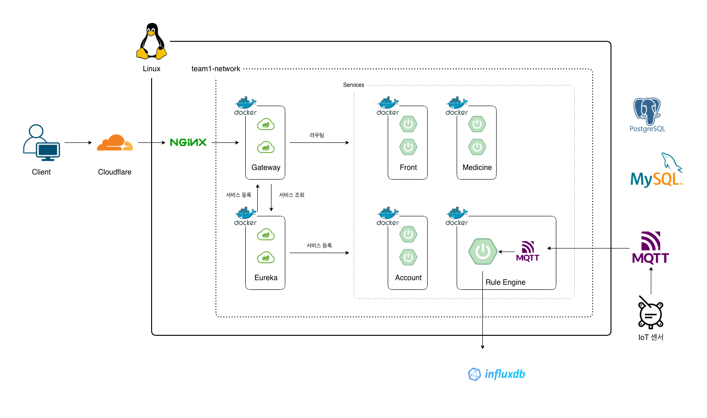

# API Gateway 패턴



## 문제

MSA에서는 데이터와 기능이 여러 서비스로 나뉘어 있다. 클라이언트가 이 서비스들을 하나하나 직접 호출하면 다음과 같은 문제가 발생한다.

- 클라이언트가 어떤 기능이 어느 서비스에 있는지 알아야 한다.
- 서비스의 실제 위치(IP/포트)는 배포, 스케일링에 따라 계속 바뀌는데, 클라이언트가 이를 직접 추적해야 한다.

### 해결 방법

클라이언트와 내부 서비스들 사이에 단일 진입점 역할을 하는 Gateway를 둔다.

Gateway는 서비스 디스커버리(Eureka)와 로드밸런서를 이용해 적절한 서비스 인스턴스로 요청을 전달한다.

### 장점

- 클라이언트가 서버 내부 구조를 몰라도 된다.
- 인증, CORS 등 클라이언트 공통 관심사를 일원화할 수 있다.
- 웹, 모바일, 외부 API 등 클라이언트별 진입점을 일관되게 제공할 수 있다.
- 서비스를 추가/분리/재배포해도 클라이언트에 미치는 영향이 최소화된다.

### 단점
- Gateway 자체도 관리해야 하므로 운영 복잡도가 증가한다.
- 요청이 Gateway를 거쳐야 하므로 네트워크 지연이 소폭 증가한다.

---

## Gateway가 최상단에 위치해야 하는 이유

### 1. 클라이언트 종류와 무관하게 진입점을 하나로 통일

현재는 Front(Thymeleaf)만 존재하지만, 향후 모바일 앱이나 외부 API 제공이 추가될 수 있다.

- **Gateway가 최상단**: 모바일 앱 -> Gateway -> Medicine/Account API로, Front를 거치지 않고 바로 필요한 서비스에 접근할 수 있다.
- **Front가 최상단**: 모바일 앱도 Front를 거치거나, 모바일 전용 진입 경로를 별도로 또 만들어야 한다. 외부 진입점이 증가하고 아키텍처가 분기된다.

Gateway를 단일 진입점으로 두면 클라이언트 종류가 늘어나도 클라이언트의 진입 방식은 그대로 유지된다.

### 2. Front가 프록시 역할까지 수행

Front를 모든 요청의 진입점으로 두면 화면 렌더링뿐만 아니라 프록시 역할까지 함께 맡게 된다.

API Gateway 패턴에서는 Gateway가 라우팅을 담당하고, Front는 화면 렌더링에 집중한다.

### 3. 횡단 관심사의 일원화

인증(JWT 검증 및 전달), 라우팅, Rate Limiting, CORS, 요청 로깅 등 클라이언트와 공통 관심사를 Gateway에서 일관적으로 처리할 수 있다.

### 4. SPA로 전환해도 진입점이 유지된다

우리 프로젝트의 Front는 Thymeleaf 기반 서버 사이드 렌더링(SSR) 구조이다. 현재 구조에서는 브라우저가 Front만 바라보고, API 호출은 전부 Front 뒤에 숨겨져 있어서 Gateway가 최상단이어야 하는 이유가 와닿지 않을 수 있다. 하지만 나중에 Front를 React/Vue 기반의 SPA로 전환하면 어떨까?

```
현재 (SSR): 브라우저 -> Gateway -> Front -> Gateway -> Medicine/Account/RuleEngine

SPA(React/Vue) 전환: 브라우저(JS)가 Medicine/Account/RuleEngine을 각각 직접 호출
    브라우저 -> Gateway -> Medicine
    브라우저 -> Gateway -> Account
```

SPA로 바꾸면 브라우저가 API를 직접 호출하는 주체가 된다.
- **Gateway가 최상단**: Front는 정적 파일만 내려주는 역할로 축소되고, 브라우저의 API 호출 대상이 Gateway라는 사실은 그대로이다. 현재 진입점 구조가 전혀 바뀌지 않는다.
- **Front가 최상단**: SPA의 API 호출은 Front를 거칠 이유가 전혀 없으므로, 이를 우회하는 새로운 진입 경로를 통째로 새로 만들어야 한다. 즉 SSR -> SPA 전환이 곧 아키텍처의 재설계가 되어버린다.

---

## Front와 Gateway

### Front는 다른 서비스에 어떻게 요청을 보내는가?

```
1) 브라우저 -> Gateway -> Front
   (ex: 의약품 재고 목록 요청)

2) Front -> Gateway -> Medicine / Account / RuleEngine
  (Front가 화면을 완성하는 데 필요한 데이터를 서버 대 서버로 조회)

3) Front가 받아온 데이터를 Thymeleaf 템플릿에 채워 완성된 HTML을 만듦

4) Front -> Gateway -> 브라우저
  (완성된 HTML을 응답으로 돌려줌 - 브라우저는 별도 API 호출을 하지 않아도 완성된 화면을 내려받을 수 있음)
```

페이지 이동 등으로 새로운 화면이 필요할 때마다 이 1~4단계가 반복된다.

### Front가 서버 대 서버로 호출하면 Gateway가 필요 없는 것이 아닌가?

Front가 Eureka로부터 서비스를 찾은 후 돌아온 주소로 직접 API를 호출하는 것도 가능하다.

- 직접 호출: Front -> Eureka (주소 조회) -> Medicine (직접 요청)
- Gateway 경유: Front -> Gateway -> Medicine

그럼에도 Front가 Gateway를 거쳐야 하는 이유가 존재한다.

1. 서비스 디스커버리와 로드밸런싱 로직을 별도로 구현해야 한다.

Eureka는 등록된 인스턴스 목록만 제공하는 레지스트리이다. 여러 인스턴스 중 이번 요청을 어디로 보낼지 결정하는 로드밸런싱 로직은 별도로 필요하다.

Gateway는 Eureka + Spring Cloud LoadBalancer로 이 과정을 처리하고 있지만, Front가 직접 API를 호출하면 서비스 디스커버리와 로드밸런싱을 이용해 적절한 인스턴스를 선택하는 로직을 Front에도 별도로 구현해야 한다.

2. Front가 모든 서비스의 존재를 알아야 한다.

직접 호출 방식이면 Front가 어떤 기능을 어떤 서비스가 제공하는지 모두 알아야 하고, 서비스가 추가/변경될 때마다 Front 코드도 같이 수정해야 한다.

Gateway를 거치면 Front는 API 계약(URL, 요청/응답 형식)만 알고, 실제 서비스의 위치(IP/포트)나 인스턴스 수는 알 필요가 없다.

---

### 결론

Gateway는 호출 빈도가 아니라 단일 진입점이라는 역할 때문에 모든 서비스 앞에 위치한다.
Front는 화면 렌더링에 집중하고, Gateway는 모든 클라이언트의 단일 진입점으로서 라우팅과 공통 정책을 담당한다.

## 참고
- [API 게이트웨이 패턴 - microservices.io](https://microservices.io/patterns/apigateway.html)