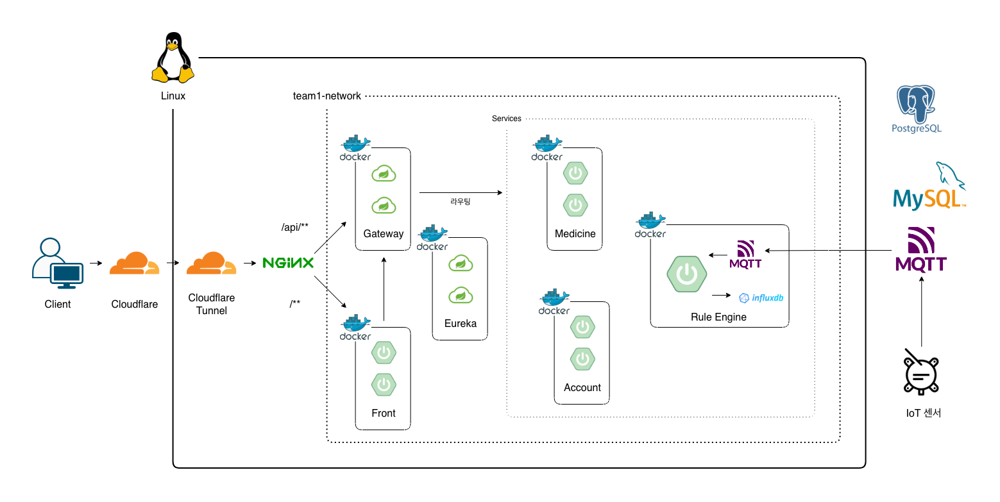

# MSA 인프라 가이드



## 1. 도메인 & DNS 설정

### 1.1 도메인 등록 및 네임서버 위임

* **도메인**: `iunot.cloud` 및 `www.iunot.cloud`
* **DNS 관리**: 가비아에서 도메인을 구매한 후, 네임서버를 **Cloudflare**로 위임하여 관리. 이를 통해 Cloudflare의 CDN, 캐싱 및 보안 필터링(DDoS 방어 등) 혜택을 기본적으로 적용받을 수 있다.

### 1.2 포트 할당 범위 제약

모든 팀이 하나의 서버를 할당받아 사용한다. 따라서 상호 간의 포트 충돌을 방지하기 위해 우리 팀은 **`10400 ~ 10419`** 대역만 할당받아 사용한다.

```
10400 Gateway-1
10401 Gateway-2
10402 Eureka-1
10403 Eureka-2
10404 Front-1
10405 Front-2
10406 Rule-Engine
10407 ?
10408 Mosquitto
10409 InfluxDB
10410 Grafana
10411 Inventory-1
10412 Inventory-2
10413 Account-1
10414 Account-2
10415 ?
10416 ?
10417 ?
10418 Zipkin
10419 Alert
```

---

## 2. HTTP/HTTPS (보안 및 SSL/TLS 정책)

HTTPS 처리를 위해 서버 내에 직접 SSL 인증서를 설치하지 않고, **Cloudflare Tunnel(cloudflared)**을 적용한다.

```
클라이언트 요청 처리 순서

1. [클라이언트] iunot.cloud 접속 요청
2. [Cloudflare] HTTPS(443) 수신, TLS 종료, 유해 트래픽 필터링
3. [cloudflared] 미리 Cloudflare로 아웃바운드 연결을 걸어 상시 터널 유지 
  [Cloudflare -> cloudflared] 클라이언트 요청을 그 터널을 통해 서버로 전달
  (서버는 이 요청을 받기 위해 별도의 인바운드 포트를 열 필요 없이 이미 열려있는 터널로 받음)
4. [cloudflared -> Nginx] localhost:80로 요청 전달

5. [Nginx] 경로 기준 분기
  - `/api/**` -> team1_gateway upstream (10400/10401)
  - 그 외(`/**`) -> team1_front upstream (10404/10405)
```

* 클라이언트와 Cloudflare 간 통신은 HTTPS로 암호화되며, Cloudflare Tunnel은 서버와 Cloudflare 간 별도의 인바운드 포트 개방 없이 연결을 제공한다. Tunnel 이후의 로컬 구간은 `localhost:80`을 통해 Nginx로 전달된다.
* 이전에는 Cloudflare가 서버 공인 IP:80에 평문 HTTP로 직접 연결하는 Flexible SSL 방식을 사용했으나, Cloudflare-Nginx 구간이 암호화되지 않는다는 한계가 있었다.
* 현재는 Cloudflare Tunnel(cloudflared)을 도입해 서버가 인바운드 포트를 열지 않고 아웃바운드 연결만으로 Cloudflare와 통신한다.

---

## 3. 리버스 프록시 (cloudflared & Nginx)

Cloudflare Tunnel과 Nginx를 조합해 외부 요청을 호스트명과 경로 기준으로 단계적으로 라우팅한다.

- **cloudflared**: 호스트네임 기준 라우팅 (iunot.cloud | grafana.iunot.cloud | zipkin.iunot.cloud -> 각 로컬 포트)
- Nginx: 경로 기준 라우팅 (`/api/**` vs `/**`)

## 3.1 cloudflared 설정 (`config.yaml`)

```yaml
ingress:
  - hostname: iunot.cloud
    service: http://localhost:80    # Nginx (Front / Gateway)
    
  - hostname: www.iunot.cloud
    service: http://localhost:80    # Nginx (Front / Gateway)
    
  - hostname: grafana.iunot.cloud
    service: http://localhost:10410 # Grafana 대시보드
    
  - hostname: zipkin.iunot.cloud
    service: http://localhost:10418 # Zipkin 대시보드
    
  - service: http_status:404        # 그 외 - 404
```

### 3.2 Nginx 설정 (`site.conf`)

호스트 OS에 설치된 Nginx는 cloudflared로부터 전달받은 트래픽을 경로 기준으로 Front 또는 Gateway로 분기하는 역할을 수행한다.

```nginx
# 서버 목록 정의
upstream team1_gateway {
    server 127.0.0.1:10400 max_fails=3 fail_timeout=10s;
    server 127.0.0.1:10401 max_fails=3 fail_timeout=10s;
}

upstream team1_front {
    server 127.0.0.1:10404 max_fails=3 fail_timeout=10s;
    server 127.0.0.1:10405 max_fails=3 fail_timeout=10s;
}

server {
    listen 127.0.0.1:80;
    server_name iunot.cloud www.iunot.cloud;

    access_log /home/aiot3/aiot3-team1/infra/nginx/logs/access.log;
    error_log  /home/aiot3/aiot3-team1/infra/nginx/logs/error.log;

    # /api/**는 gateway로 (외부 API 진입점)
    location /api/ {
        proxy_set_header X-Forwarded-For $proxy_add_x_forwarded_for;    # 원본 클라이언트 IP 전달
        proxy_set_header X-Forwarded-Proto $scheme;                     # 원본 프로토콜 전달
        proxy_set_header Host $http_host;                               # 원래 요청의 Host 헤더(iunot.cloud) 전달

        proxy_pass http://team1_gateway;                                # 실제 요청을 넘길 대상(upstream)
    }

    # 나머지는 전부 front로 (SSR 페이지)
    location / {
        proxy_set_header X-Forwarded-For $proxy_add_x_forwarded_for;
        proxy_set_header X-Forwarded-Proto $scheme;
        proxy_set_header Host $http_host;

        proxy_pass http://team1_front;
    }
}
```

* **경로 기반 분기**: `/api/**`는 Gateway로, 나머지는 Front로 직접 라우팅한다.
* **이중화 + 패시브 헬스체크**: Front, Gateway 각각 2개 인스턴스로 로드밸런싱하며, 설정을 통해 3회 연속 실패한 인스턴스는 10초간 트래픽에서 제외한다.
* **클라이언트 IP 전달**: Cloudflare 프록시 체인을 거쳐 들어오므로, `$proxy_add_x_forwarded_for` 헤더 설정을 사용하여 클라이언트의 원래 접속 IP를 최종 백엔드 서비스까지 온전히 전달한다.

---

## 4. API Gateway & Eureka (MSA 라우팅)

```
마이크로서비스의 유레카 등록 및 감지 순서

1. [Account] Account 컨테이너가 가동(docker compose up)된다.
2. [Account -> Eureka] application.yaml에 등록된 eureka service-url(team1-eureka-1, team1-eureka-2)에 자신의 인스턴스 ID와 health(UP) 등록 요청을 전송한다.
3. [Eureka Peering] team1-eureka-1과 team1-eureka-2가 서로 정보를 교환하여 양쪽 서버 모두에 account 인스턴스 정보가 동기화된다.
4. [Gateway -> Eureka] 게이트웨이는 30초마다 유레카의 서비스 레지스트리를 Fetch하여 로컬 캐시에 저장한다.
5. [Client -> Gateway] 클라이언트가 Gateway로 접속 시, Gateway는 로컬 캐시에서 account의 실제 컨테이너 IP를 찾아 로드밸런싱하여 트래픽을 전달한다.
```

```
[Nginx] -> [Gateway-1 / 2]
                |
                +-- (Discovery) --> [Eureka-1 / 2]
                |
                +-- (Route: lb://) -> 실제 서비스 (account, rule-engine, ...)
```

### 4.1 Eureka Server 클러스터링

2대의 유레카 서버가 서로 레지스트리를 교환(Peering)하도록 도커 네트워크상에서 서로를 바라보게 구성한다.
* **Eureka-1 Peer URL**: `http://team1-eureka-2:10403/eureka/`
* **Eureka-2 Peer URL**: `http://team1-eureka-1:10402/eureka/`
* Peer 동기화를 위해 각각 `register-with-eureka`와 `fetch-registry` 프로퍼티를 `true`로 설정한다.

### 4.2 Gateway 라우팅 및 정적 라우팅 전략

보안을 위해 서비스 디스커버리에 등록된 대상을 자동으로 노출하지 않고, 게이트웨이에 코드 형태로 라우팅 경로를 정적 선언하는 방식을 사용한다.

```java
@Configuration
public class RouteLocatorConfig {

   @Bean
   public RouteLocator routeLocator(RouteLocatorBuilder builder) {
      return builder.routes()
              .route("team1-account", p ->
                      p.path("/api/admin/accounts/**", "/api/accounts/**").uri("lb://account"))
              .route("team1-rule-engine", p ->
                      p.path("/api/rule-engine/**").uri("lb://rule-engine"))
              .build();
   }
}
```

### 4.3 Gateway & Eureka 캐시 갱신 주기와 배포 지연

- 유레카 서버와 유레카 클라이언트는 각각 레지스트리 정보를 캐싱하며, Gateway는 유레카 클라이언트를 통해 서비스 인스턴스 정보를 주기적으로 갱신한다. 따라서 서비스 상태 변경이 Gateway의 실제 라우팅에 반영되기까지 일정 시간이 발생할 수 있다.

---

## 5. Docker & 컨테이너 실행 환경

Dockerfile은 작성된 소스 코드를 컴파일하고, 구동에 필요한 런타임(JRE) 환경을 묶어 도커 이미지로 빌드하기 위한 설계도로, 서버 환경이나 개발자 PC 환경에 상관 없이 동일한 실행 결과(이식성)를 보장한다.

### 5.1 Dockerfile

```Dockerfile
# 1. 빌드 전용 이미지 (JDK 포함, 최종 이미지엔 안 들어감)
FROM eclipse-temurin:21-jdk AS build
WORKDIR /app

# 의존성만 먼저 복사해서 캐싱 (소스코드 변경돼도 의존성 안 바뀌면 이 레이어 재사용됨)
COPY .mvn/ .mvn
COPY mvnw pom.xml ./
RUN chmod +x mvnw && ./mvnw dependency:go-offline -B

# 소스코드 복사 후 빌드 (테스트는 CI에서 이미 돌리니 스킵)
COPY src ./src
RUN ./mvnw clean package -DskipTests -B

# 2. 실행 전용 이미지 (JRE만, 빌드도구 없어서 이미지 크기 작음)
FROM eclipse-temurin:21-jre
WORKDIR /app

# 헬스체크/디버깅용 curl 설치, 이후 캐시 삭제해서 이미지 용량 절약
RUN apt-get update && apt-get install -y --no-install-recommends curl \
    && rm -rf /var/lib/apt/lists/*

# 빌드 단계 결과물(jar)만 가져옴, 소스/빌드도구는 최종 이미지에 안 남음
COPY --from=build /app/target/*.jar app.jar

# root로 실행하지 않도록 비루트 사용자 지정 (보안)
USER 1000

ENTRYPOINT ["java", "-jar", "app.jar"]
```

* 빌드 단계와 실행 단계를 분리하여 최종 배포 이미지에 컴파일 도구와 소스 코드가 포함되지 않도록 한다.
* 컨테이너 침해 시 호스트 OS 권한 취득을 방지하기 위해 컨테이너 내부 실행 권한을 루트가 아닌 `USER 1000`으로 고정하여 구동한다.

### 5.2 docker-compose 및 외부 네트워크 구성

Dockerfile이 개별 서비스를 실행할 이미지를 만드는 도구라면, Docker Compose는 만들어진 여러 개의 서비스 컨테이너들을 묶어서 한꺼번에 실행하고 관리하는 코디네이터 역할을 수행한다. 포트 번호 매핑, 환경변수 주입, 컨테이너 가동 순서, 컨테이너 간 통신을 위한 가상 네트워크 설정을 파일 하나(`compose.yaml`)에 코드로 적어두고 명령어 한 줄로 통합 제어하기 위해 사용한다.

팀별로 독립된 컨테이너 공간을 확보하고, 타 팀 서비스와의 간섭을 없애기 위해 격리 규칙을 적용한다.
* 모든 컨테이너와 네트워크 이름에 `team1-` 접두어를 사용한다.
* 도커 네트워크(`team1-network`)를 사전에 생성하여 공유한다.

```yaml
# compose.yaml

services:
   account-1:
      image: ghcr.io/${GHCR_OWNER}/account:${IMAGE_TAG:-latest}
      container_name: team1-account-1 # 도커 네트워크 안에서 다른 컨테이너가 이 이름으로 접근 (예: 게이트웨이가 team1-account:10413로 호출)
      environment:
         SERVER_PORT: 10413
         SPRING_PROFILES_ACTIVE: prod
      ports:
         - "127.0.0.1:10413:10413"   # 호스트포트(컨테이너 외부로 노출할 포트):컨테이너포트(실제 서비스 포트)
      restart: unless-stopped       # 컨테이너 죽으면 자동재시작, 수동으로 stop한 경우엔 안 살림
      logging:
         driver: json-file           # 도커 기본 로깅 드라이버, 로그를 파일로 저장
         options:
            max-size: "10m"           # 로그파일 하나당 최대 10MB
            max-file: "3"             # 최대 3개까지만 보관 (넘으면 오래된 것부터 삭제)
      networks: [team1-network]
   account-2:
      image: ghcr.io/${GHCR_OWNER}/account:${IMAGE_TAG:-latest}
      container_name: team1-account-2
      environment:
         SERVER_PORT: 10414
         SPRING_PROFILES_ACTIVE: prod
      ports:
         - "127.0.0.1:10414:10414"
      restart: unless-stopped
      logging:
         driver: json-file
         options:
            max-size: "10m"
            max-file: "3"
      networks: [team1-network]

networks:
   team1-network:
      external: true
```

---

## 6. CI/CD 및 무중단 배포 (Rolling Update)

GitHub Actions에서 빌드, 테스트, 이미지 빌드(GHCR Push)까지 마친 뒤, 원격 서버에 접속하여 GHCR에 로그인한 뒤 이미지를 pull하여 배포한다.

```
CI/CD 배포 파이프라인 순서 요약

[1. 빌드 및 테스트 (GitHub Actions Runner)]
1. 코드 체크아웃, JDK 21 설정
2. ./mvnw clean verify (clean -> compile -> test -> verify)

[2. 이미지 빌드 및 GHCR Push]
3. GHCR 로그인
4. Docker 이미지 빌드 후 latest + 커밋 SHA 태그로 GHCR에 Push

[3. 서버 배포 (SSH -> account-cd.sh]
5. 서버가 GHCR에서 해당 태그(커밋 SHA) 이미지 pull
6. 배포 대상 인스턴스(account-1)를 Eureka에서 `OUT_OF_SERVICE`로 전환
7. 유레카 서버 응답 캐시(30초) + 게이트웨이 로컬 캐시(30초) 갱신을 기다려 65초 대기 (5초 여유 시간)
8. docker compose up -d --force-recreate로 해당 인스턴스 재기동
9. 헬스체크(/actuator/health) 엔드포인트로 인스턴스가 활성화되었는지 체크. 최대 60초(30회 * 2초) 대기
10. account-2도 6~9번 반복
11. 전체 성공 시 .last-good-tag 갱신, 실패 시 이전 성공 태그로 전체 롤백
```

```yml
# Account의 ci.yml 간소화 버전

name: Account CI/CD

on:
   push:
      branches: [ main ]
   pull_request:
      branches: [ main ]

jobs:
   build-test:
      name: 빌드 및 테스트
      runs-on: ubuntu-latest
      steps:
         - name: 체크아웃 # Repository 코드를 러너로 클론
           uses: actions/checkout@v7

         - name: JDK 21 설정
           uses: actions/setup-java@v5
           with:
              distribution: temurin
              java-version: "21"
              cache: maven # ~/.m2 의존성 캐싱 -> 2회차부터 빌드 빨라짐

         - name: 빌드 및 테스트
           run: ./mvnw -B clean verify # clean -> compile -> test -> verify

   build-push:
      name: 이미지 빌드 및 GHCR Push
      needs: build-test
      if: github.event_name == 'push' && github.ref == 'refs/heads/main'
      runs-on: ubuntu-latest
      permissions:
         contents: read
         packages: write
      steps:
         - name: 체크아웃
           uses: actions/checkout@v7

         - name: GHCR 로그인
           uses: docker/login-action@v4
           with:
              registry: ghcr.io
              username: ${{ github.actor }}
              password: ${{ secrets.GITHUB_TOKEN }}

         - name: 이미지 빌드 및 푸시 (latest + 커밋SHA)
           uses: docker/build-push-action@v7
           with:
              context: .
              push: true
              tags: |
                 ghcr.io/nhnacademy-aiot3-iunot/account:latest
                 ghcr.io/nhnacademy-aiot3-iunot/account:${{ github.sha }}

   deploy:
      name: 배포
      needs: build-push
      runs-on: ubuntu-latest
      steps:
         - name: 배포
           uses: appleboy/ssh-action@v1
           with:
              host: ${{ secrets.SERVER_HOST }}
              username: ${{ secrets.SERVER_USER }}
              key: ${{ secrets.SERVER_SSH_KEY }}
              script: |
                 set -e
                 cd ~/account
                 IMAGE_TAG=${{ github.sha }} ./deploy/account-cd.sh

```

```sh
# account-cd.sh 간소화 버전

#!/bin/bash
# 에러 발생 시 스크립트 실행을 즉시 중단
set -e

git pull origin main
cd ~/account

export GHCR_OWNER="nhnacademy-aiot3-iunot"
NEW_TAG="${IMAGE_TAG:-latest}"
LAST_GOOD_FILE=".last-good-tag"
OLD_TAG=$(cat "$LAST_GOOD_FILE" 2>/dev/null || echo "latest")

SERVICES=("account-1" "account-2")
PORTS=("10413" "10414")

# 지정한 태그로 전체 인스턴스 롤링 배포, 실패하면 false 반환
deploy_tag() {
  local tag="$1"
  export IMAGE_TAG="$tag"
  docker compose pull

  for i in "${!SERVICES[@]}"; do
    SERVICE="${SERVICES[$i]}"
    PORT="${PORTS[$i]}"

    # 유레카 및 라우터에서 해당 인스턴스 제외
    echo "${SERVICE} 유레카 상태 변경 (OUT_OF_SERVICE)"
    curl -sf -X POST -H "Content-Type: application/json" \
      -d '{"status": "OUT_OF_SERVICE"}' \
      "http://127.0.0.1:${PORT}/actuator/serviceregistry"

    echo "${SERVICE} 유레카 갱신 대기 (65초)"
    sleep 65;

    echo "${SERVICE} 재배포 (tag=${tag})"
    docker compose up -d --force-recreate "$SERVICE"

    for attempt in {1..30}; do
      if curl -sf "http://127.0.0.1:${PORT}/actuator/health" 2>/dev/null | grep -q '"status":"UP"'; then
        echo "${SERVICE} 배포 성공"
        break;
      fi

      if [ "$attempt" -eq 30 ]; then
        echo "${SERVICE} 배포 실패 (타임아웃, tag=${tag})"
        return 1;
      fi

      sleep 2;
    done
  done

  return 0
}

if deploy_tag "$NEW_TAG"; then
  echo "$NEW_TAG" > "$LAST_GOOD_FILE"
  docker image prune -f
else
  echo "새 버전(${NEW_TAG}) 배포 실패, 이전 버전(${OLD_TAG})으로 롤백"
  deploy_tag "$OLD_TAG" || echo "롤백도 실패함, 수동 확인 필요"
  docker image prune -f
  exit 1
fi


```

### 6.1 무중단 롤링 배포 흐름 (`account-cd.sh`)

```
[team1-account-1] OUT_OF_SERVICE 전환 -> (65초 대기) -> 재배포 -> 헬스체크 통과 확인 -> [team1-account-2] 동일 진행
```

1. **상태 전환 (`OUT_OF_SERVICE`)**:
   배포 대상 인스턴스로 향하는 신규 트래픽 유입을 즉시 차단하기 위해 해당 인스턴스(Account) 자신의 Actuator를 호출하여 유레카 서버 상에서 상태를 `OUT_OF_SERVICE`로 변경한다.
2. **대기 시간 `sleep 65`**:
   유레카 서버와 각 클라이언트들은 시스템 부하를 줄이기 위해 서비스 인스턴스 레지스트리를 즉시 동기화하지 않고 주기적으로 캐싱한다.
   유레카 레지스트리 변경 사항이 게이트웨이의 서비스 디스커버리 캐시에 반영되는 데 시간이 필요하므로, 현재는 충분한 전파 시간을 확보하기 위해 65초를 대기한다. 이 값은 실제 전파 시간을 측정해 산정한 값이 아닌 임시 안전값이며, 추후 실제 환경에서 전파 시간을 측정해 조절할 예정이다.
3. **헬스체크 검증**:
   재생성 완료 후 `http://127.0.0.1:${PORT}/actuator/health` 를 주기적으로 폴링하여 해당 인스턴스의 상태가 정상적으로 `"UP"` 상태가 되었는지 확인한 후 다음 인스턴스의 배포를 진행한다.

### 6.2 확인 사항

- Account처럼 Eureka Discovery로 호출되는 서비스는 OUT_OF_SERVICE + 65초 대기로 캐시 전파를 기다린 뒤 안전하게 재배포한다.
- Front, Gateway처럼 Nginx의 site.conf에 정적 upstream으로 고정 참조되는 서비스는 Eureka 상태와 무관하다. 이 경우 OUT_OF_SERVICE 전환이 무의미하여, Nginx의 패시브 헬스체크(max_fails/fail_timeout)로 대체한다.
- '배포 대상이 Eureka로 발견되는지 여부'에 따라 두 가지 롤링 배포 전략이 공존한다.

---

## 7. 관찰 가능성 (Observability)

### 7.1. 로그 수집 (Filebeat)

- Docker의 `json-file` 로그 드라이버로 기록된 컨테이너 로그를 Filebeat가 수집한다.
- Docker autodiscover를 사용하여 `team1` 컨테이너를 자동으로 감지하고 로그 수집 설정을 적용한다.
- 수집된 로그는 공용 Elasticsearch 서버의 `team1-logs-*` 인덱스에 저장하여 다른 팀의 로그와 분리한다.
- ILM 정책을 적용하여 30일이 경과한 인덱스를 자동으로 삭제한다.

### 7.2. 메트릭 및 분산 추적
- Grafana: InfluxDB 및 ElasticSearch를 데이터 소스로 활용한 통합 대시보드 시각화
- Zipkin: 분산 추적
- 둘다 127.0.0.1에 바인딩해, Cloudflare Tunnel로만 접근할 수 있도록 설정

### 7.3 Zero Trust Access

- Grafana / Zipkin 서브도메인은 Cloudflare Zero Trust로 접근 제어
- 등록된 이메일만 OTP 검증 후 접근 가능